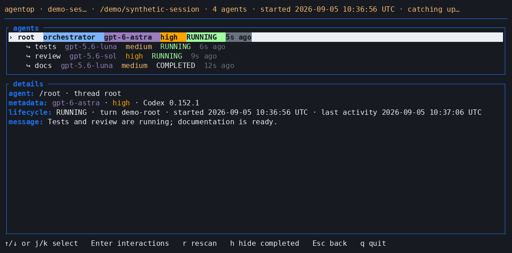

# Agentop

[](https://github.com/quarrel/agentop/actions/workflows/ci.yml)

Agentop is a read-only terminal UI for observing Codex multi-agent sessions. It reconstructs agent trees, lifecycle state, recent activity, tool use, interaction history, and context pressure from the rollout JSONL files Codex already writes.



*Actual TUI with synthetic demo data. [Recording script](scripts/record-demo.mjs).*

It works with Codex CLI sessions and sessions created through the Codex IDE extension when their rollout files are available in the same sessions directory. Agentop does not control Codex or require changes to the sessions it observes.

## Installation

### Prebuilt Linux binary

Tagged releases publish a **64-bit Intel/AMD Linux** (`x86_64`, also called `amd64`) archive and SHA-256 checksum on the [GitHub Releases](https://github.com/quarrel/agentop/releases) page. The binary targets `x86_64-unknown-linux-gnu` and is built on Ubuntu 22.04 using glibc. This is not a 32-bit x86, ARM64, or Alpine/musl build.

Download the `.tar.gz` archive and its `.tar.gz.sha256` file into the same directory, verify with `sha256sum -c <archive>.tar.gz.sha256`, then extract the archive and place the `agentop` executable on your `PATH`.

### Install from source

A stable Rust toolchain is required:

```bash
cargo install --git https://github.com/quarrel/agentop.git --locked
```

From a local checkout:

```bash
cargo install --path . --locked
```

The crates.io package named [`agentop`](https://crates.io/crates/agentop) is a different project. Do not use `cargo install agentop` for this repository. If this project is published to crates.io later, it will need a distinct package name while retaining the `agentop` executable name.

Agentop is developed and tested on Linux/amd64. Other platforms may work but are not currently covered by CI.

## Quick start

Run Agentop:

```bash
agentop
```

The sessions directory is resolved in this order:

1. `--sessions-dir <path>`
2. `$CODEX_HOME/sessions`
3. `$HOME/.codex/sessions`

With no `--session`, Agentop opens a browser of the most recently updated sessions. The project label comes from the root rollout's recorded repository name, falling back to its recorded working directory. Select a session with Enter, or open one directly with an exact session ID or unique prefix:

```bash
agentop --session 01abc
agentop --sessions-dir /path/to/sessions --session 01abc
```

Use `--color=none` to disable explicit terminal colours. `--color=auto` is the default and enables colour in the required interactive terminal.

## Usage

```text
Usage: agentop [OPTIONS] [COMMAND]

Commands:
  build-schema    Fetch and catalogue schemas for new official Codex releases

Options:
  --sessions-dir <PATH>
  --session <ID_OR_PREFIX>
  --color <auto|none>
  -V, --version
```

## Task Visibility

OpenAI now encrypt agent<->agent messages. The lack of these can be ameliorated with `developer_instructions` in `.codex/config.toml`

To make subagent assignments readable in the interaction view, ask agents to announce their task before starting work and to announce any messages they receive. Add the following top-level setting to `.codex/config.toml` in a specific repository (Codex must trust the project), or to `~/.codex/config.toml` for all Codex instances using that user configuration. If `developer_instructions` already exists, merge this section into its existing string; project settings take precedence over user settings. Start a new Codex session after changing the configuration. Placing these in `developer_instructions` vs `AGENTS.md` or similar is preferable because of Codex's precedence rules for instructions.

```toml
developer_instructions = """
# Subagent task announcement

When acting as a subagent and you receive a NEW_TASK message from a parent:

1. Before doing any work, send a commentary message consisting of:
   `Task: ` followed by the NEW_TASK payload verbatim.
2. The task is only the NEW_TASK payload. Do not include inherited conversation
   context, developer instructions, routing metadata, the sender, or your agent name.

# Inter-agent message announcement

When you receive an inter-agent MESSAGE or FINAL_ANSWER:

1. Before doing further work, send a commentary message consisting of:
   `Received from ` followed by the sender, then `: ` followed by the
   message payload verbatim.
2. Include only that message's payload. Do not include inherited
   conversation context, developer instructions, or routing metadata
   other than the sender.
3. This applies to root agents and subagents.
"""
```

## Controls

| View | Key | Action |
| --- | --- | --- |
| Session browser | ↑/↓ or j/k | Select a session |
| Session browser | Enter | Open the selected session |
| Session browser | r | Refresh the session list |
| Agent tree | ↑/↓ or j/k | Select an agent |
| Agent tree | Enter | Open the selected agent's interaction history |
| Agent tree | s | Open the whole-orchestration summary |
| Summary | ↑/↓ or j/k, PgUp/PgDn | Scroll totals, roles, tools and agents |
| Summary | Enter on an agent row | Open that agent's interactions |
| Summary | s or Esc | Return to the agent tree |
| Agent tree | h | Hide or show completed agents |
| Agent tree | r | Rescan for rollout updates and new agents |
| Interaction history | ↑/↓ or j/k | Move through retained interactions |
| Any nested view | Esc | Return one level |
| Any view | q | Quit |

Opening a session renders its root promptly and adds agents progressively while historical records are reduced. Live rollouts and newly created child rollouts continue to appear without reopening the session.

## Status and context

Agentop reports the latest observed turn lifecycle:

| Status | Meaning |
| --- | --- |
| `PENDING` | No running or terminal turn has been observed yet |
| `RUNNING` | The latest observed turn is active |
| `WAITING ON AGENT ↓` | The newest unfinished call is exactly `wait_agent`; the relevant child normally follows below |
| `COMPLETED` | The latest observed turn completed |
| `INTERRUPTED` / `ERRORED` | Codex recorded a terminal interruption or error |
| `STALE` | The rollout still says running, but later session evidence indicates it is no longer active; completion is unknown |

`STALE` is deliberately conservative. Agentop prefers a later complete `list_agents` snapshot that excludes the agent and otherwise requires at least two hours of later meaningful session activity. It never converts stale evidence into a completion claim.

For active agents, `CTX n%` is the latest observed request input count divided by the reported model context window. It is not a live counter. Yellow begins at 70% and red at 85%. Completed and stale agents omit context pressure because it is no longer actionable. Cumulative token usage is labelled separately and is never treated as current context occupancy.

The interaction view retains bounded, sanitised lifecycle, message, reasoning, communication, context-management, and paired tool-call summaries. It does not retain raw tool inputs or outputs.

## Orchestration summary

Press `s` in the agent tree to inspect the root and all discovered agents, including hidden completed agents. The live summary shows elapsed run span, summed agent turn time, role totals, reported token counters, tool call counts and latencies, waits for agents and execution, concurrency, context peaks, compactions and evidence gaps. Scroll to an agent and press Enter to inspect its interactions; Esc returns to the summary.

Elapsed span includes gaps between turns. Summed agent time includes overlapping work and can exceed elapsed time. Tool time is the union of open calls within each agent's turns; agent waits and execution waits are overlapping subsets. Execution waits include `wait` calls and recognised empty terminal polls. Tool latency measures the recorded call/return boundary, not the full lifetime of a background command or tools nested inside an execution wrapper. Time outside tools is unattributed: it is **not measured thinking time**.

Tokens are the latest reported cumulative counters from each agent's own retained history boundary, with coverage shown for each field. Snapshots are not added together; cached input and reasoning output are subsets, not extra tokens. Producer counters may include inherited baselines or decrease after a reset, so summed reported counters are not a unique-run or billing total. Compaction does not erase these measurements.

Totals remain partial while history loads or evidence is missing. Stale agents are not extrapolated to the current time. Concurrency counts running turns, including waits, and is unavailable when timing evidence is incomplete or its bounded interval catalogue is exceeded. Diagnostics identify evidence to inspect, not a claim about the cause of slow or failed work.

## Compatibility and schema catalogue

Codex rollout formats change frequently, and one sessions directory can contain files written by several producer versions. Agentop therefore identifies every rollout by its exact `session_meta.payload.cli_version`; it does not infer compatibility from a version range or substitute a nearby version.

The embedded catalogue maps exact Codex versions to canonical `RolloutLine.json` schema hashes. Structurally identical releases share one schema family. Catalogue membership proves schema provenance only. Runtime claims are separate:

- **Catalogued:** the exact version maps to a verified schema family.
- **Ingestable:** Agentop can discover, group, and tail it without crashing.
- **Semantically covered:** representative fixtures establish the reducer behaviour.
- **Live verified:** that exact version has been exercised against a running producer.

Agentop targets tolerant ingestion of the Codex 0.149 family and later, but semantic coverage is claimed only where there is fixture or live evidence. Unknown fields and variants are expected; malformed required data remains visible as a bounded diagnostic.

Update the user catalogue for official Codex releases newer than the binary:

```bash
agentop build-schema
```

This explicit command is the only Agentop operation that uses the network or writes catalogue data. It reads official immutable tag provenance from the [codex-cli GitHub repo](https://github.com/openai/codex), downloads the stable precomputed export, extracts only `RolloutLine.json`, and stores unique schemas by canonical hash. See [the schema catalogue documentation](schemas/README.md).

## Privacy and scope

Normal TUI operation treats the sessions directory as immutable input: it never writes, truncates, renames, moves, deletes, or locks rollout files for writing. It is also offline.

Rollouts can contain sensitive prompts, messages, reasoning, commands, paths, and identifiers. Agentop sanitises and bounds terminal text, but anyone who can run it already has access to the underlying files. Do not publish real rollouts, raw diagnostics, or unsanitised recordings.

Agentop deliberately has no database, daemon, remote control, cross-machine monitoring, trace backend, app-server integration, payload decryption, or plugin system.

## Development

See [Development](docs/DEVELOPMENT.md) for build, test, schema, recording, and release workflows, and [Architecture](docs/ARCHITECTURE.md) for the ingestion and reducer contracts.

## Licence

Agentop is licensed under the GNU General Public License, version 2 or any later version. See [LICENSE.md](LICENSE.md).
